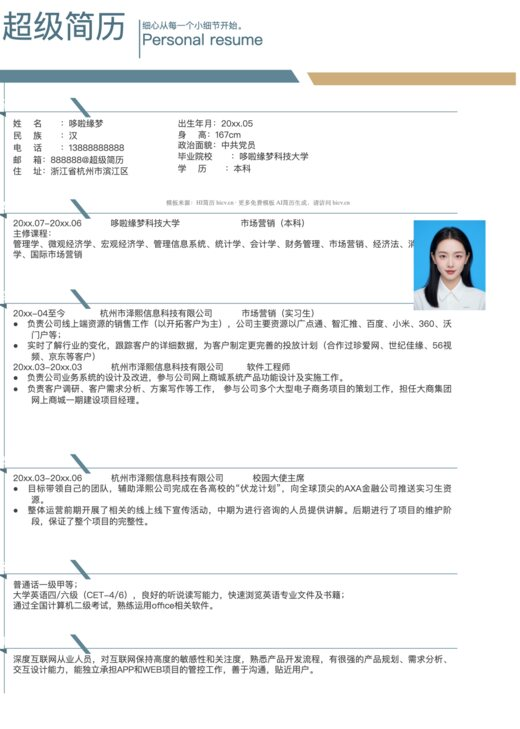
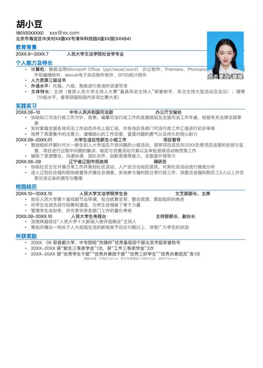
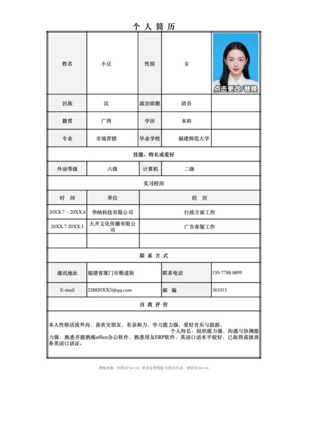
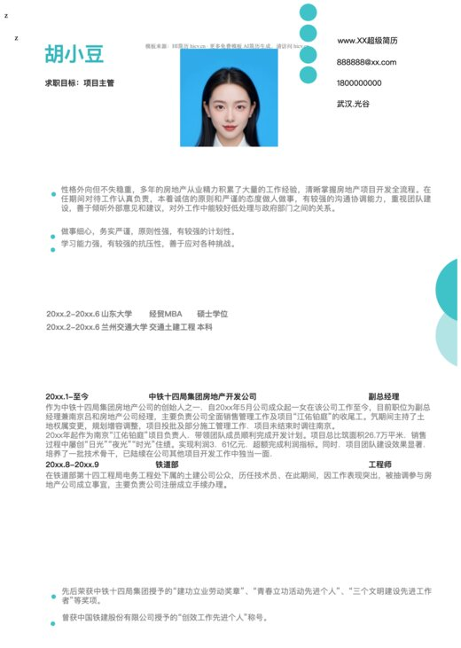
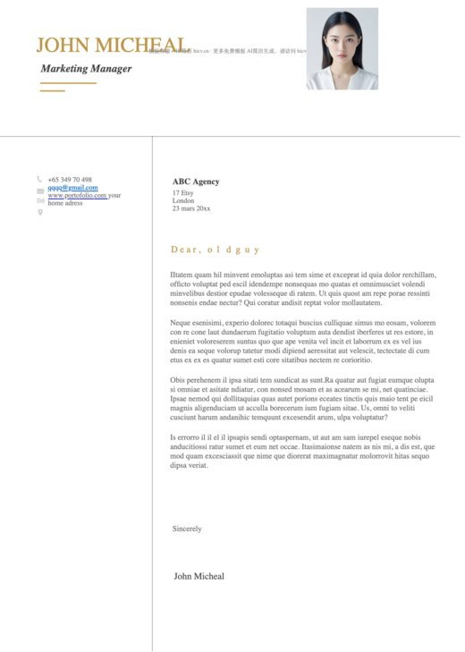
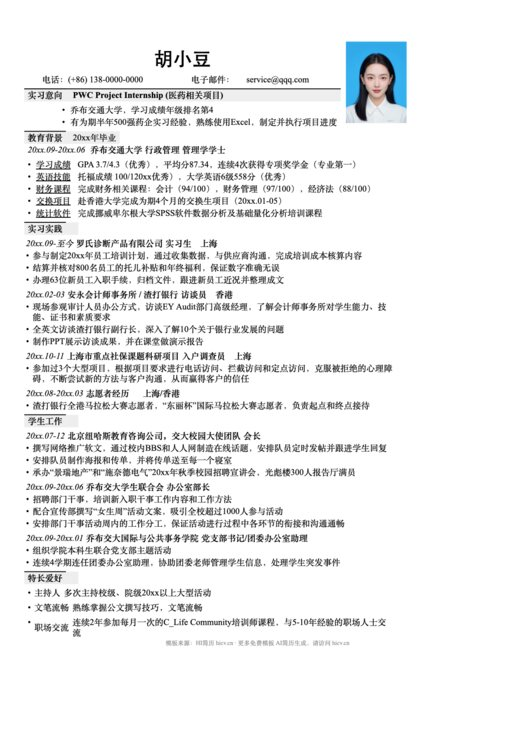

# HICV 简历模板库：2,132 套 Word 简历模板免费下载

这里整理了 2,132 套可编辑 Word 简历模板，覆盖中文个人简历、应届生简历、表格简历、行业岗位简历、研究生复试简历、自荐信和英文简历等常见求职场景。

模板均为 `.docx` 格式，可使用 Microsoft Word、WPS Office 或兼容 DOCX 的编辑器打开修改。

**[在线浏览模板并制作简历](https://hicv.cn/templates?utm_source=github&utm_medium=referral&utm_campaign=word_resume_templates&utm_content=readme_primary)** · [查看完整模板索引](./TEMPLATE_INDEX.md) · [打开模板文件目录](./templates)

## 真实模板预览

以下图片由仓库中的 DOCX 文件直接渲染。点击图片可查看对应文件。

<table>
  <tr>
    <td align="center"> 简约单页 001</td>
    <td align="center"> 极简蓝色单页</td>
    <td align="center"> 表格单页 001</td>
  </tr>
  <tr>
    <td align="center"> 项目管理单页</td>
    <td align="center"> 英文单页 001</td>
    <td align="center"> 四大实习模板</td>
  </tr>
</table>

## 高频模板专题

- [简约单页 Word 简历模板](https://hicv-cn.github.io/hicv-word-resume-templates/categories/minimalist-single-page/)
- [表格 Word 简历模板](https://hicv-cn.github.io/hicv-word-resume-templates/categories/table-resume/)
- [职业岗位 Word 简历模板](https://hicv-cn.github.io/hicv-word-resume-templates/categories/professional-resume/)
- [行业专属 Word 简历模板](https://hicv-cn.github.io/hicv-word-resume-templates/categories/industry-resume/)
- [英文 Word 简历模板](https://hicv-cn.github.io/hicv-word-resume-templates/categories/english-resume/)
- [研究生复试 Word 简历模板](https://hicv-cn.github.io/hicv-word-resume-templates/categories/postgraduate-interview/)

## 求职场景专题

以下专题页复用仓库现有模板，按搜索场景重新整理，适合秋招、实习和热门岗位快速筛选：

- [秋招校招 Word 简历模板](https://hicv-cn.github.io/hicv-word-resume-templates/categories/campus-recruitment/)
- [实习与应届生 Word 简历模板](https://hicv-cn.github.io/hicv-word-resume-templates/categories/internship-entry-level/)
- [教师教育行业 Word 简历模板](https://hicv-cn.github.io/hicv-word-resume-templates/categories/teacher-resume/)
- [金融财务 Word 简历模板](https://hicv-cn.github.io/hicv-word-resume-templates/categories/finance-resume/)
- [设计视觉 Word 简历模板](https://hicv-cn.github.io/hicv-word-resume-templates/categories/design-resume/)
- [技术开发 Word 简历模板](https://hicv-cn.github.io/hicv-word-resume-templates/categories/technology-resume/)

## 模板分类

| 分类 | 适用场景 | 数量 |
| --- | --- | ---: |
| 表格简历 | 传统表格式简历，适合信息密度高、稳妥清晰的中文简历 | 118 |
| 简约简历 | 现代简约风格，覆盖单页、双页、三页、四页等版式 | 897 |
| 封面页 | 独立简历封面，可搭配多页简历或求职材料使用 | 28 |
| 活泼明朗 | 校招、实习、创意岗位等更年轻的简历风格 | 18 |
| 简约优雅 | 行政、运营、职能类岗位常用的清爽简历版式 | 29 |
| 文艺清新 | 教育、传媒、内容、设计等方向的清新风格模板 | 20 |
| 稳重大气 | 管理、金融、咨询、成熟职场场景的正式简历 | 25 |
| 职业风格 | 通用求职、办公岗位、职业化岗位简历模板 | 102 |
| 行业专属 | 教师、医学、财务、销售、技术、运营等行业简历 | 496 |
| 小红书风格 | 更适合社媒审美和年轻求职者的视觉简历 | 29 |
| 英文简历 | 英文简历、英文 CV、外企和留学申请相关模板 | 81 |
| 研究生复试 | 复试简历、调剂申请表、研究生面试材料 | 32 |
| 小升初自我介绍 | 学生自我介绍、成长展示、小升初材料 | 17 |
| 其他风格 | 莫兰迪、古风、艺术气质、现代时尚等创意模板 | 223 |
| 自荐信与范文 | 自荐信、求职信、简历范文和配套文书 | 17 |

## 使用方式

1. 进入 [模板文件目录](./templates) 或 [完整模板索引](./TEMPLATE_INDEX.md)。
2. 按风格、行业和页数选择 `.docx` 文件。
3. 下载后用 Word 或 WPS 修改个人信息、教育经历、实习经历和项目经历。
4. 投递前导出 PDF，避免不同设备打开时出现排版变化。

需要在线套用模板、检查经历表达或根据目标岗位优化内容，可进入 [HICV 在线简历模板](https://hicv.cn/templates?utm_source=github&utm_medium=referral&utm_campaign=word_resume_templates&utm_content=readme_bottom)。

## 更新与反馈

- 版本更新见 [Releases](https://github.com/HICV-CN/hicv-word-resume-templates/releases)。
- 模板目录由 `scripts/generate-site.mjs` 统一生成，站点与索引会保持同步。
- 如有模板分类或文件问题，请提交 [Issue](https://github.com/HICV-CN/hicv-word-resume-templates/issues)。

## 授权说明

模板可免费使用和转发，请保留 [HICV.cn](https://hicv.cn?utm_source=github&utm_medium=referral&utm_campaign=word_resume_templates&utm_content=readme_license) 来源信息。详见 [LICENSE](./LICENSE)。
